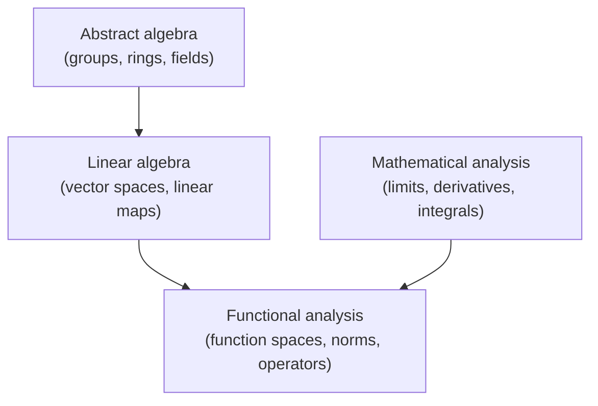

---
aliases:
created: 2025-09-03 18:07
parent:
  - "[[517 Сalculus MOC]]"
connected:
  - "[[512.64  Linear algebra MOC]]"
tags:
  - content/moc
---
- Это раздел, выросший на стыке анализа и линейной алгебры.
- Основная идея:
    - рассматривать **функции не как формулы, а как элементы векторных пространств** (часто бесконечномерных).
    - изучать их с помощью понятий: **норма, метрика, топология, оператор**.
- Главные объекты:
    - **нормированные пространства** (Банаховы),
    - **гильбертовы пространства** (с inner product),
    - **линейные операторы** на этих пространствах.
- Это базис для квантовой механики, теории операторов, современных PDE, машинного обучения (например, ядровые методы).

- [[Inner product of vectors]]