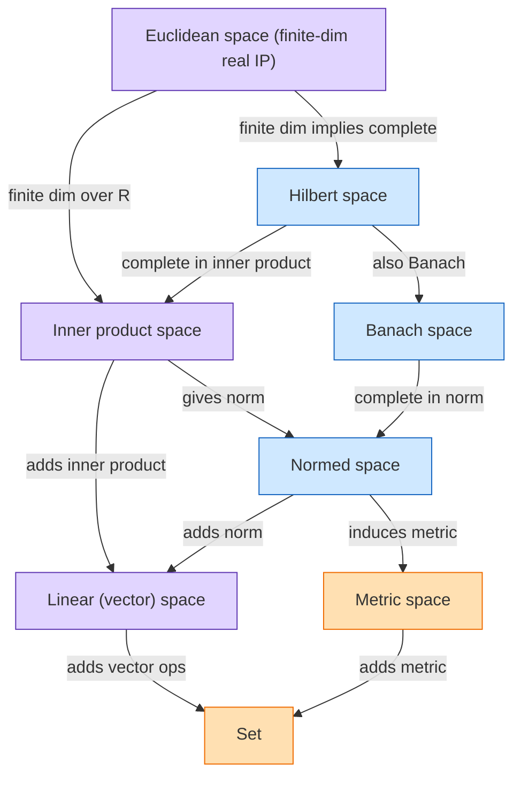

---
aliases:
anki: false
created: 2025-09-03 19:35
parent:
  - "[[Set (math)]]"
connected:
tags:
  - fix/empty
  - fix/linking
---

Normed space
Inner product space
Banach space (complete normed)
Hilbert space (complete inner product)
Euclidean space
Metric space