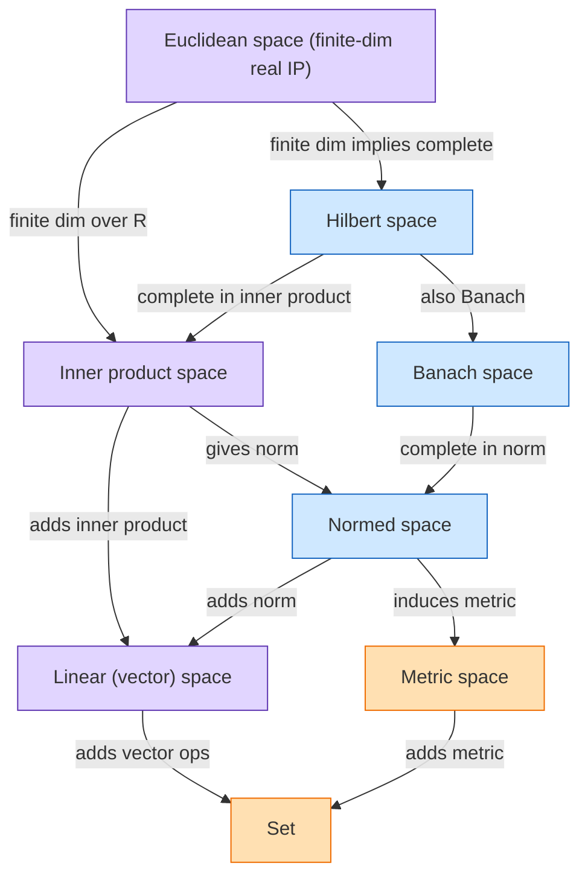

---
aliases:
anki: false
created: 2025-09-03 19:35
parent:
  - "[[Set (math)]]"
connected:
tags:
  - fix/empty
  - fix/linking
---
Space это [[Set (math)]] множество + выбранная [[Structure (math)]] структура + подходящие морфизмы

[[Structure (math)]]

| Space                              | [[metric]] | [[norm]] | [[completeness]] | [[Inner product]] | [[Dot product of vectors]] | finite-dim over $\mathbb{R}$ |
| ---------------------------------- | :--------: | :------: | :--------------: | :---------------: | :------------------------: | :--------------------------: |
| [[Linear (vector) space]]          |     —      |    —     |        —         |         —         |             —              |              —               |
| [[Metric space]]                   |     ✅      |    —     |        —         |         —         |             —              |              —               |
| [[Normed space]]                   |     ✅      |    ✅     |        —         |         —         |             —              |              —               |
| [[Banach space]]                   |     ✅      |    ✅     |        ✅         |         —         |             —              |              —               |
| [[Inner product space]]            |     ✅      |    ✅     |        —         |         ✅         |             —              |              —               |
| [[Hilbert space]]                  |     ✅      |    ✅     |        ✅         |         ✅         |             —              |              —               |
| [[Euclidean space]] $\mathbb{R}^n$ |     ✅      |    ✅     |        ✅         |         ✅         |             ✅              |              ✅               |

| Концепт                      | Основной раздел                             | Папка / Теги                               | Связанные заметки                                                                                          | Заметки-подсказки                        |
| ---------------------------- | ------------------------------------------- | ------------------------------------------ | ---------------------------------------------------------------------------------------------------------- | ---------------------------------------- |
| [[Vector space]]             | Linear Algebra                              | LA/VectorSpaces  #linear-algebra           | [[Linear map]], [[Basis]], [[Dimension]]                                                                   | База без геометрии                       |
| [[Inner product]] | Linear Algebra (finite)                     | LA/InnerProduct  #linear-algebra           | [[Dot product of vectors]], [[Orthogonality]]                                                              | Операция на парах                        |
| [[Inner product space]]      | LA ↔ Functional Analysis                    | LA/InnerProduct  #linear-algebra #fa       | [[Norm of vector]], [[Orthogonal projection]]                                                              | IP ⇒ норма                               |
| [[Dot product of vectors]]   | Linear Algebra                              | LA/Euclidean   #linear-algebra             | [[Euclidean space]], [[Gram–Schmidt]]                                                                      | Стандарт в ℝⁿ                            |
| [[Norm of vector]]           | Functional Analysis                         | FA/Norms        #fa                        | [[Metric (distance)]], [[Banach space]]                                                                    | Даёт метрику                             |
| [[Metric (distance)]]        | Topology / Analysis                         | TOP/Metric      #topology                  | [[Cauchy sequence]], [[Completeness]]                                                                      | d(x,y)=‖x−y‖                             |
| [[Normed space]]             | Functional Analysis                         | FA/NormedSpaces #fa                        | [[Banach space]], [[Linear operator]]                                                                      | Общая рамка                              |
| [[Banach space]]             | Functional Analysis                         | FA/Banach       #fa                        | [[Normed space]], [[Hahn–Banach theorem]]                                                                  | Полнота по норме                         |
| [[Hilbert space]]            | Functional Analysis                         | FA/Hilbert      #fa                        | [[Inner product space]], [[Riesz representation]]                                                          | Полнота по IP                            |
| [[Cauchy sequence]]          | Topology / Analysis                         | TOP/Sequences   #topology                  | [[Completeness]], [[Metric (distance)]]                                                                    | Критерий полноты                         |
| [[Completeness]]             | Topology / Analysis                         | TOP/Completeness #topology                 | [[Banach space]], [[Hilbert space]]                                                                        | «Без дырок»                              |
| [[Euclidean space]]          | Linear Algebra (finite); also FA & Topology | LA/Euclidean #linear-algebra #fa #topology | [[Dot product of vectors]], [[Norm of vector]], [[Metric (distance)]], [[Completeness]], [[Hilbert space]] | Конечномерный IP; норма→метрика; полнота |
