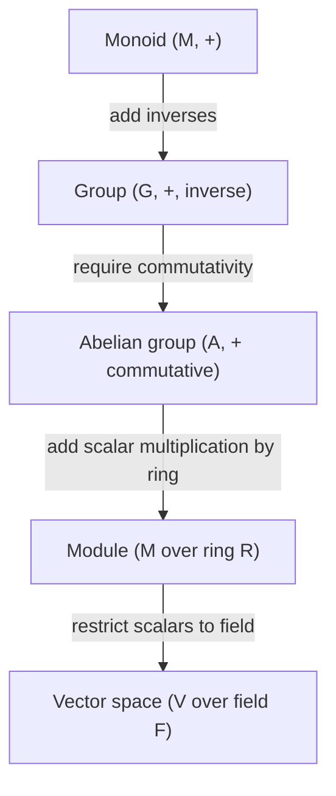

---
aliases:
  - Векторное пространство
  - Линейное пространство
  - Vector space
created: 2025-09-03 18:52
parent:
  - "[[Abelian group]]"
  - "[[Space]]"
connected:
  - "[[Vector]]"
  - "[[Linear algebra (field)]]"
anki: false
tags:
  - fix/empty
---
Векторное пространство — это [[Abelian group|Абелева группа]] (по сложению) с действием [[Field (F,+,*)]] [[Scalar]] поля скаляров, удовлетворяющим аксиомам линейности.
Vector space = абелева группа + линейное действие поля.

==Векторное пространство V== - множество всех векторов V, которые можно складывать друг с другом и умножать на скаляр

Множество всех векторов $V$, которые можно складывать друг с другом и умножать на скаляры, называют векторным пространством.

Это означает, что:
- для любых $\vec{a} \in V$ и $\vec{b} \in V$ существует $\vec{a} + \vec{b} \in V$;
- для произвольных $\vec{a} \in V$ и $k \in \mathbb{R}$ определён вектор $k \cdot \vec{a} \in V$.

Кроме этого, должны действовать следующие свойства:

1) ${\vec{a} + \vec{b} = \vec{b} + \vec{a}}$ — коммутативность сложения;
2) ${(\vec{a} + \vec{b}) + \vec{c} = \vec{a} + (\vec{b} + \vec{c})}$ — ассоциативность сложения;
3) $\forall \vec{a} \ \vec{a} + \vec{0} = \vec{a}$ — существование нулевого вектора;
4) $\forall \vec{a} \ \exists (-\vec{a}) : \ \vec{a} + (-\vec{a}) = \vec{0}$ — существование противоположного вектора;
5) ${1 \cdot \vec{a} = \vec{a}}$ — умножение на единицу сохраняет вектор;
6) ${k \cdot (m \cdot \vec{a}) = (k \cdot m) \cdot \vec{a}}$ — ассоциативность относительно скаляра;
7) ${ (k + m) \cdot \vec{a} = k \cdot \vec{a} + m \cdot \vec{a}}$ — distributivity of scalar multiplication over vector sum;
8) ${k \cdot (\vec{a} + \vec{b}) = k \cdot \vec{a} + k \cdot \vec{b}}$ — distributivity of scalar multiplication over vector sum.

Важно условие: результат суммы или произведения также должен являться вектором этого пространства.

#### Properties
- [[Abelian group]] of [[Addition operation]] $+$
    -   If $\vec{u}$ and $\vec{v}$ are vectors in $V$, then $\vec{u}+\vec{v}$ is also in $V$. [[Closure of]]
    - [[Associative identity]] [[Addition operation]]  $(\vec{u}+\vec{v})+\vec{w}=\vec{u}+(\vec{v}+\vec{w})$ 
    - “zero vector” in $V$, appropriately called “$0$”, so that $\vec{v}+0=v$ for all $\vec{v}$ in $V$.
    - If $\vec{v}$ is a vector in $V$, then there is a vector $\vec{−v}∈V$ so that $\vec{v}+(\vec{-v})=0$.
    - commutativity (adding) $\vec{u}+\vec{v}=\vec{v}+\vec{u}$
- [[Scalar]] [[Multiplication operation]]
    - If $\vec{u}$ is a vector in $V$, then $c\vec{u}$ is also in $V$ for any constant $c$. [[Closure of]]
    - associativity (scalar multiplication) $(c_1c_2)\vec{v}=c_1(c_2\vec{v})$
- distributivity $c(\vec{u}+\vec{v})=c\vec{u}+c\vec{v}$ and
- $(c_1+c_2)\vec{v}=c_1v+c_2\vec{v}$
