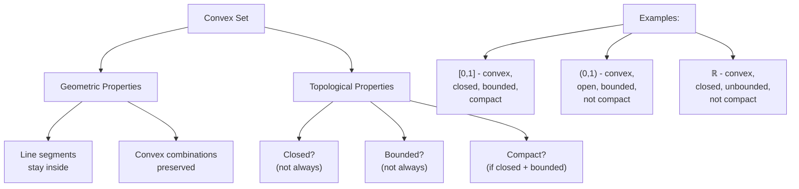

---
aliases:
  - Выпулкое множество
anki: true
created: 2024-10-27 21:46
parent:
  - "[[Set (math)]]"
connected:
  - "[[Affine set]]"
  - "[[Line segment]]"
  - "[[Convex combination]]"
  - "[[Cone set]]"
  - "[[Convex hull - conv(S)]]"
  - "[[Operations preserving convexity]]"
  - "[[Closed set]]"
  - "[[Bounded set]]"
  - "[[Compact set]]"
  - "[[Open set]]"
tags:
---

> [!tip] Convex set (geometric definition)  
is the set $S$  
if for any $x_1, x_2$ from $S$, the [[Line segment|line segment]] passing through them also lies in $S$, i.e.  
$\forall \theta \in [0, 1], \forall x_1, x_2 \in S:$
$\theta x_1 + (1-\theta) x_2 \in S$.

> [!tip] Convex set (сombination definition)  
is a set that is closed under all possible [[Convex combination|convex combinations]] of its points.

| ![[Convex_polygon_illustration1.svg\|200]] | ![[Convex_polygon_illustration2.svg\|200]] |
| ------------------------------------------ | ------------------------------------------ |
| Convex set                                 | Non convex set                             |

###### Examples
Top: examples of convex sets. Bottom: examples of non-convex sets.
![[convex_sets.svg]]

- [[Polyhedron (3D)]]
- [[Hyperplane]]
- Balls in any proper norm and ellipsoids
- Set of symmetric and non-negative definite matrices

![[Affine set#Relationship between convex and affine set]]

## Topological Properties

### Convexity vs Topological Properties

### Key Relationships

- **Convex ≠ [[Closed set|Closed]]**: $(0,1)$ is convex but [[Open set|open]]
- **Convex ≠ [[Bounded set|Bounded]]**: $\mathbb{R}$ is convex but unbounded  
- **Convex ≠ [[Compact set|Compact]]**: Need both closed and bounded
- **Convex + Closed + Bounded = Compact** (in $\mathbb{R}^n$)

### Important Examples

1. **Closed ball**: $\overline{B}(0,r) = \{x : \|x\| \leq r\}$ 
   - Convex ✓, [[Closed set|Closed]] ✓, [[Bounded set|Bounded]] ✓, [[Compact set|Compact]] ✓

2. **Open ball**: $B(0,r) = \{x : \|x\| < r\}$
   - Convex ✓, [[Open set|Open]] ✓, [[Bounded set|Bounded]] ✓, Not [[Compact set|Compact]] ✗

3. **Interval $[0,1]$**: 
   - Convex ✓, [[Closed set|Closed]] ✓, [[Bounded set|Bounded]] ✓, [[Compact set|Compact]] ✓

4. **Interval $(0,1)$**:
   - Convex ✓, [[Open set|Open]] ✓, [[Bounded set|Bounded]] ✓, Not [[Compact set|Compact]] ✗

# Anki
TARGET DECK: math::optimization
START
Math_TWO_side
FRONT: Convex set (geometric definition)  
BACK: is the set $S$  
if for any $x_1, x_2$ from $S$, the [[Line segment|line segment]] passing through them also lies in $S$, i.e.  
FORMULA: $\forall \theta \in [0, 1], \forall x_1, x_2 \in S:$
$\theta x_1 + (1-\theta) x_2 \in S$.
ADDITIONAL:
[[Polyhedron (3D)]]
[[Hyperplane]]
Balls in any proper norm and ellipsoids
Set of symmetric and non-negative definite matrices
PICTURE:
| ![[Convex_polygon_illustration1.svg\|200]] | ![[Convex_polygon_illustration2.svg\|200]] |
| ------------------------------------------ | ------------------------------------------ |
| Convex set                                 | Non convex set                             |
ID: 1734778303394
END

TARGET DECK: math::optimization
START
Math_TWO_side
FRONT: Convex set (сombination definition)  
BACK: is a set that is closed under all possible [[Convex combination|convex combinations]] of its points.
ADDITIONAL:
[[Polyhedron (3D)]]
[[Hyperplane]]
Balls in any proper norm and ellipsoids
Set of symmetric and non-negative definite matrices
PICTURE:
| ![[Convex_polygon_illustration1.svg\|200]] | ![[Convex_polygon_illustration2.svg\|200]] |
| ------------------------------------------ | ------------------------------------------ |
| Convex set                                 | Non convex set                             |
ID: 1734778303407
END
