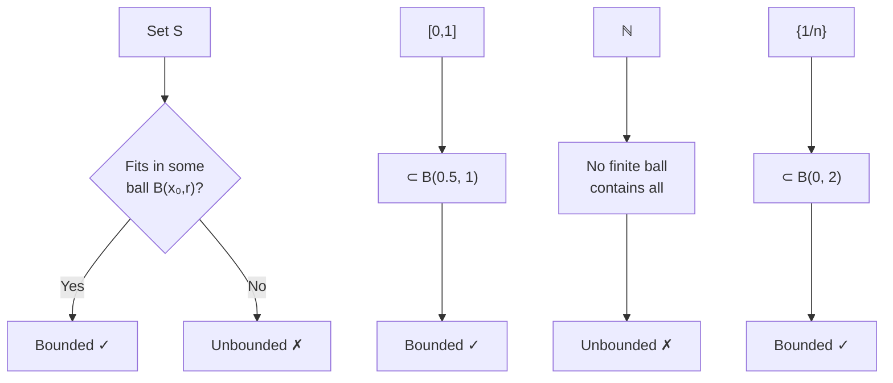

---
aliases:
  - Ограниченное множество
  - Bounded subset
anki: true
created: 2024-12-22 13:20
parent:
  - "[[515.1 Topology]]"
connected:
  - "[[Metric space]]"
  - "[[Compact set]]"
  - "[[Closed set]]"
  - "[[Diameter of set]]"
tags:
  - content/definition
---

> [!tip] Bounded Set
> A subset $S$ of a [[Metric space|metric space]] $(X,d)$ is **bounded** if there exists $M > 0$ such that $d(x,y) \leq M$ for all $x,y \in S$.

## Equivalent Definitions

1. **Diameter definition**: $\text{diam}(S) = \sup\{d(x,y) : x,y \in S\} < \infty$
2. **Ball definition**: $S \subset [[Open Ball|B(x_0, r)]]$ for some center $x_0$ and radius $r$
3. **Coordinate-wise** (in $\mathbb{R}^n$): Each coordinate is bounded

## Key Properties

- **Subset**: Subset of bounded set is bounded
- **Union**: Finite union of bounded sets is bounded
- **[[Continuous function|Continuous]] image**: [[Continuous function|Continuous]] image of [[Bounded set|bounded set]] may not be bounded
- **[[Compact set|Compact sets]]**: Every [[Compact set|compact set]] is bounded

## Examples

### Bounded Sets in $\mathbb{R}$
- $[a,b]$ - closed intervals (diameter = $|b-a|$)
- $(a,b)$ - open intervals  
- $\{1, 2, 3, ..., n\}$ - finite sets
- $\{\frac{1}{n} : n \in \mathbb{N}\}$ - sequence converging to 0

### Unbounded Sets in $\mathbb{R}$
- $\mathbb{R}$ - entire real line
- $[0,\infty)$ - half-lines
- $\mathbb{N}$ - natural numbers
- $\{n^2 : n \in \mathbb{N}\}$ - growing sequence

## Visual Representation

## In Different Spaces

### $\mathbb{R}^n$
$S$ bounded ⟺ $\exists M : |x_i| \leq M$ for all $x = (x_1,...,x_n) \in S$

### Function Spaces
In $C([0,1])$: $f$ bounded ⟺ $\sup_{x \in [0,1]} |f(x)| < \infty$

## Connection to Compactness

**[[Heine-Borel theorem]]**: In $\mathbb{R}^n$, [[Compact set|compact]] = [[Closed set|closed]] + [[Bounded set|bounded]]

# Anki

TARGET DECK: stem::math::topology
START
math_basic_double
FRONT: Bounded set
BACK: A set that fits inside some ball of finite radius
ID: 1755890967083
END

TARGET DECK: stem::math::topology
START
math_basic_single
FRONT: Is every bounded set compact?
BACK: No. In ℝⁿ you need both closed AND bounded. Example: (0,1) is bounded but not compact
ID: 1755890967086
END

TARGET DECK: stem::math::topology
START
math_basic_single
FRONT: Bounded sets and finite unions
What happens to boundedness under finite unions?
BACK: Finite union of bounded sets is bounded (take maximum of all radii)
ID: 1755890967089
END
