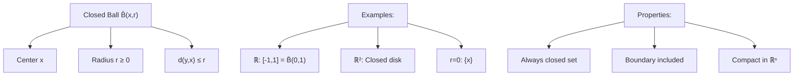

---
aliases:
  - Замкнутый шар
  - Closed neighborhood
  - Closed disk
anki: true
created: 2024-12-22 15:05
parent:
  - "[[515.1 Topology]]"
connected:
  - "[[Metric space]]"
  - "[[Closed set]]"
  - "[[Open Ball]]"
  - "[[Distance function]]"
  - "[[Compact set]]"
tags:
  - content/definition
---

> [!tip] Closed Ball $\overline{B}(x,r)$
> The **closed ball** centered at point $x$ with radius $r \geq 0$ in a [[Metric space|metric space]] $(X,d)$ is the set of all points whose distance from $x$ is less than or equal to $r$.
> $$\overline{B}(x,r) = \{y \in X : d(x,y) \leq r\}$$

## Key Properties

- **Center**: $x \in X$ (always belongs to the ball)
- **Radius**: $r \geq 0$ (non-negative, can be zero)
- **Closed**: Every closed ball is a [[Closed set|closed set]]
- **Boundary included**: Points at distance exactly $r$ are included
- **Compact**: In $\mathbb{R}^n$, closed balls are [[Compact set|compact]]

## Examples

### In $\mathbb{R}$ (Real Line)
- $\overline{B}(0,1) = [-1,1]$ - closed interval
- $\overline{B}(2,3) = [-1,5]$ - closed interval around 2  
- $\overline{B}(a,\epsilon) = [a-\epsilon, a+\epsilon]$ - closed neighborhood

### In $\mathbb{R}^2$ (Plane)
- $\overline{B}((0,0),1) = \{(x,y) : x^2 + y^2 \leq 1\}$ - closed unit disk
- $\overline{B}((a,b),r) = \{(x,y) : (x-a)^2 + (y-b)^2 \leq r^2\}$ - closed disk

### In Discrete Metric
For discrete metric $d(x,y) = \begin{cases} 0 & \text{if } x = y \\ 1 & \text{if } x \neq y \end{cases}$:
- $\overline{B}(x,0) = \{x\}$ - singleton (radius 0)
- $\overline{B}(x,r) = \{x\}$ for any $0 < r < 1$
- $\overline{B}(x,1) = X$ - entire space

## Relationship to [[Open Ball]]

For any center $x$ and radius $r > 0$:
- $B(x,r) \subseteq \overline{B}(x,r)$ (open ball contained in closed ball)
- $\overline{B(x,r)} = \overline{B}(x,r)$ (closure of open ball equals closed ball)
- $\text{int}(\overline{B}(x,r)) = B(x,r)$ (interior of closed ball is open ball)

## Visual Representation

## Special Cases

### Radius Zero
$\overline{B}(x,0) = \{x\}$ - singleton set (always closed)

### Large Radius
If $\text{diam}(X) \leq 2r$, then $\overline{B}(x,r) = X$ for any $x \in X$

## Applications

1. **[[Compact set|Compactness]]**: In $\mathbb{R}^n$, closed balls are compact ([[Heine-Borel theorem]])
2. **Approximation**: Dense subsets intersect every open ball
3. **[[Continuous function|Uniform continuity]]**: On closed balls, continuous functions are uniformly continuous
4. **Fixed point theorems**: Many require closed balls or similar closed bounded sets

## Connection to Analysis

- **Completeness**: Nested sequence of closed balls in complete space has non-empty intersection
- **[[Extreme Value Theorem (EVT)]]**: Continuous functions on closed balls attain extrema
- **Banach Fixed Point**: Contractions on closed balls have unique fixed points

# Anki

TARGET DECK: stem::math::topology
START
math_basic_double
FRONT: Closed Ball $\overline{B}(x,r)$
BACK: Set of all points at distance less than or equal to $r$ from center $x$
ID: 1755934051109
END

TARGET DECK: stem::math::topology
START
math_basic_single
FRONT: Closed balls and compactness
Are closed balls in ℝⁿ always compact?
BACK: Yes, by Heine-Borel theorem - they are closed and bounded, hence compact
ID: 1755934051114
END

TARGET DECK: stem::math::topology
START
math_basic_single
FRONT: Closure of open ball
What is $\overline{B(x,r)}$ (closure of open ball)?
BACK: $\overline{B(x,r)} = \overline{B}(x,r)$ - equals the closed ball with same center and radius
ID: 1755934051118
END

TARGET DECK: stem::math::topology
START
math_complex
FRONT: Open vs Closed Ball Relationship
BACK: Open ball is contained in closed ball, and is its interior
FORMULA: $B(x,r) \subseteq \overline{B}(x,r)$ and $\text{int}(\overline{B}(x,r)) = B(x,r)$
ADDITIONAL: Closed ball includes boundary, open ball excludes it
PICTURE:
PROOF:
ID: 1755934051121
END
