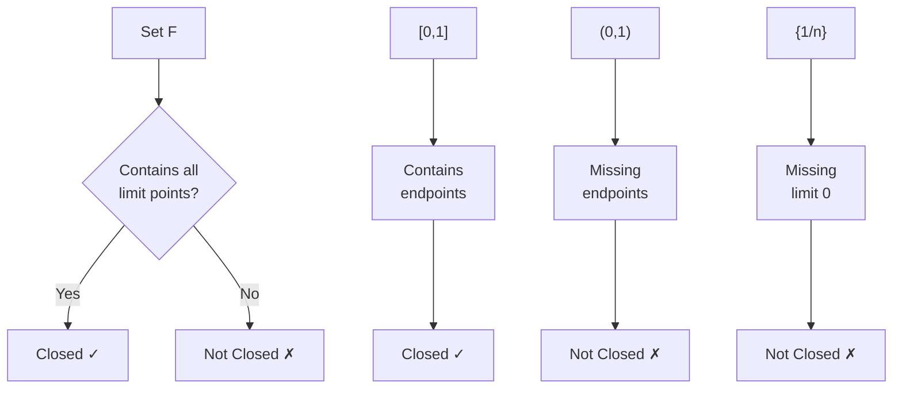

---
aliases:
  - Замкнутое множество
  - Closed subset
anki: true
created: 2024-12-22 13:15
parent:
  - "[[515.1 Topology]]"
connected:
  - "[[Metric space]]"
  - "[[Open set]]"
  - "[[Compact set]]"
  - "[[Continuous function]]"
  - "[[Complement of set]]"
tags:
  - content/definition
---

> [!tip] Closed Set
> A subset $F$ of a [[Metric space|metric space]] $(X,d)$ is **closed** if its complement $X \setminus F$ is open.

## Equivalent Characterizations

In metric spaces, the following are equivalent:

1. **Complement definition**: $F$ is [[Closed set|closed]] ⟺ $X \setminus F$ is [[Open set|open]]
2. **Limit points**: $F$ contains all its limit points (accumulation points)
3. **Sequential characterization**: If $(x_n) \subset F$ and $x_n \to x$, then $x \in F$
4. **Closure**: $F = \overline{F}$ (equals its own closure)

## Key Properties

- **Union**: Finite union of [[Closed set|closed sets]] is closed
- **Intersection**: Arbitrary intersection of [[Closed set|closed sets]] is closed
- **Complement**: Complement of [[Closed set|closed set]] is [[Open set|open]]
- **[[Continuous function|Continuous]] preimage**: If $f: X \to Y$ is [[Continuous function|continuous]], then $f^{-1}(F)$ is closed whenever $F$ is closed

## Examples

### Closed Sets in $\mathbb{R}$
- $[a,b]$ - closed intervals
- $\{a\}$ - singleton sets  
- $\mathbb{N}$ - natural numbers
- $\{0\} \cup \{\frac{1}{n} : n \in \mathbb{N}\}$ - includes limit point 0
- $\mathbb{R}$ and $\emptyset$ - trivially closed

### Non-Closed Sets in $\mathbb{R}$
- $(a,b)$ - [[Open set|open intervals]]
- $[a,b)$ - half-open intervals
- $\{\frac{1}{n} : n \in \mathbb{N}\}$ - missing limit point 0

## Visual Intuition

## Connection to Compactness

In $\mathbb{R}^n$: **[[Closed set|Closed]] + [[Bounded set|Bounded]] = [[Compact set|Compact]]** ([[Heine-Borel theorem]])

# Anki

TARGET DECK: stem::math::topology
START
math_basic_double
FRONT: Closed set
BACK: A set whose complement is open, or equivalently, contains all its limit points
ID: 1755890967093
END

TARGET DECK: stem::math::topology
START
math_basic_single
FRONT: Why is [0,1] closed but (0,1) is not?
BACK: [0,1] contains its boundary points 0 and 1, while (0,1) is missing these limit points
ID: 1755890967096
END

TARGET DECK: stem::math::topology
START
math_basic_single
FRONT: Closed sets and unions
What happens when you take the union of closed sets?
BACK: Finite union is closed, but infinite union may not be closed (e.g., $\bigcup_{n=1}^{\infty} [\frac{1}{n}, 1] = (0,1]$)
ID: 1755890967100
END
