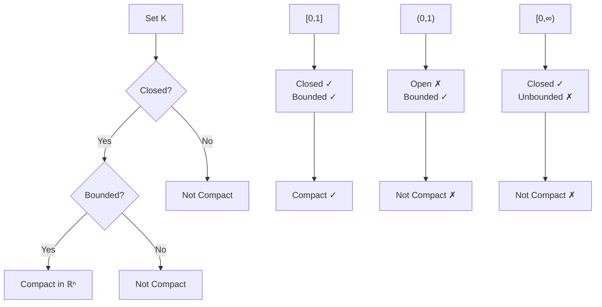

---
aliases:
  - Компактное множество
  - Compact space
anki: true
created: 2024-12-22 12:45
parent:
  - "[[515.1 Topology]]"
connected:
  - "[[Extreme Value Theorem (EVT)]]"
  - "[[Continuous function]]"
  - "[[Closed set]]"
  - "[[Bounded set]]"
  - "[[Heine-Borel theorem]]"
  - "[[Open cover]]"
  - "[[Metric space]]"
tags:
  - content/definition
---

> [!tip] Compact Set
> A subset $K$ of a metric space $(X,d)$ is **compact** if every open cover of $K$ has a finite subcover.

## Equivalent Definitions

In $\mathbb{R}^n$ with the standard metric, the following are equivalent:

1. **Open cover definition**: Every open cover has a finite subcover
2. **Sequential compactness**: Every sequence in $K$ has a convergent subsequence with limit in $K$
3. **[[Heine-Borel theorem]]**: $K$ is closed and bounded

## Key Properties

- **Closed**: Every compact set is closed
- **Bounded**: Every compact set is bounded  
- **Complete**: Every compact metric space is complete
- **Totally bounded**: Every compact metric space is totally bounded

## Examples

### Compact Sets in $\mathbb{R}$
- $[a,b]$ - any closed interval (also [[Convex Set|convex]])
- $\{0\} \cup \{\frac{1}{n} : n \in \mathbb{N}\}$ - finite set plus convergent sequence
- Any finite set
- [[Convex Set|Convex]] [[Closed Ball|closed balls]]: $\overline{B}(0,r)$ in any norm

### Non-Compact Sets in $\mathbb{R}$
- $(0,1)$ - open interval (not closed, but [[Convex Set|convex]])
- $[0,\infty)$ - half-line (not bounded, but [[Convex Set|convex]])
- $\mathbb{N}$ - natural numbers (not bounded)
- $\{1, \frac{1}{2}, \frac{1}{3}, ...\}$ - sequence without its limit (not closed)

## Connection to Analysis

Compact sets are crucial for:

1. **[[Extreme Value Theorem (EVT)]]**: Continuous functions on compact sets attain their maximum and minimum
2. **Uniform continuity**: Continuous functions on compact sets are uniformly continuous
3. **Convergence**: Many convergence theorems require compactness

## Visual Intuition

# Anki

TARGET DECK: stem::math::topology
START
math_basic_double
FRONT: Compact set
BACK: A set where every open cover has a finite subcover
ID: 1755884012708
END

TARGET DECK: stem::math::topology
START
math_complex
FRONT: Heine-Borel Theorem for ℝⁿ
BACK: A subset of ℝⁿ is compact if and only if it is closed and bounded
FORMULA: $K \subset \mathbb{R}^n$ is compact $\Leftrightarrow$ $K$ is closed and bounded
ADDITIONAL: This equivalence only holds in finite-dimensional Euclidean spaces. In general metric spaces, closed + bounded ≠ compact
PICTURE:
PROOF:
ID: 1755884012714
END

TARGET DECK: stem::math::topology
START
math_basic_single
FRONT: Why is (0,1) not compact?
BACK: It's not closed - the open cover $\{(\frac{1}{n}, 1-\frac{1}{n})\}_{n=3}^{\infty}$ has no finite subcover
ID: 1755884012719
END

TARGET DECK: stem::math::topology
START
math_basic_single
FRONT: Compact sets and continuous functions
What happens when you apply a continuous function to a compact set?
BACK: The image is also compact (continuous image of compact set is compact)
ID: 1755884012723
END
