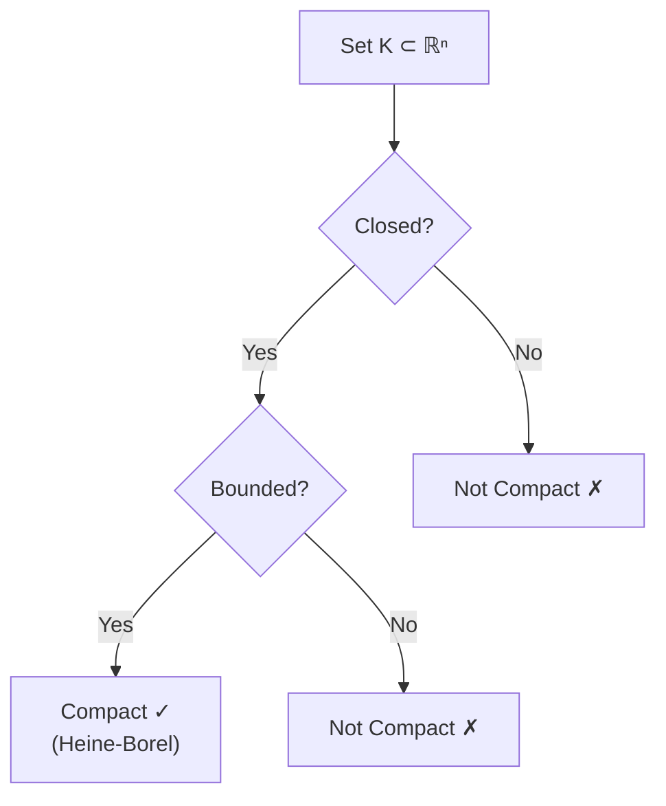

---
aliases:
  - Теорема Гейне-Бореля
  - Heine-Borel
anki: true
created: 2025-01-08 14:30
parent:
  - "[[515.1 Topology]]"
connected:
  - "[[Compact set]]"
  - "[[Closed set]]"
  - "[[Bounded set]]"
  - "[[Metric space]]"
  - "[[Open cover]]"
  - "[[Sequential compactness]]"
tags:
  - content/theorem
---

> [!tip] Heine-Borel Theorem
> In $\mathbb{R}^n$ with the standard Euclidean metric, a subset $K$ is [[Compact set|compact]] if and only if it is [[Closed set|closed]] and [[Bounded set|bounded]].

$$K \subset \mathbb{R}^n \text{ is compact} \Leftrightarrow K \text{ is closed and bounded}$$

## Statement and Significance

The [[Heine-Borel theorem]] provides a **complete characterization** of [[Compact set|compact sets]] in finite-dimensional Euclidean spaces. This equivalence is fundamental because:

1. **Easier verification**: Checking closed + bounded is often simpler than verifying open cover definition
2. **Bridge**: Connects topological property ([[Compact set|compactness]]) with metric properties ([[Closed set|closed]], [[Bounded set|bounded]])
3. **Analysis applications**: Essential for [[Extreme Value Theorem (EVT)]] and many optimization results

## Proof Outline

### Forward Direction ($\Rightarrow$): Compact $\Rightarrow$ Closed + Bounded

1. **Compact $\Rightarrow$ [[Closed set|Closed]]**: 
   - If $K$ is [[Compact set|compact]], then $K^c$ is [[Open set|open]]
   - Any convergent sequence in $K$ has its limit in $K$

2. **Compact $\Rightarrow$ [[Bounded set|Bounded]]**:
   - Cover $K$ with [[Open Ball|open balls]]: $K \subset \bigcup_{n=1}^{\infty} B(x_0, n)$
   - By compactness, finite subcover exists: $K \subset B(x_0, N)$ for some $N$

### Reverse Direction ($\Leftarrow$): Closed + Bounded $\Rightarrow$ Compact

This is the deeper direction, typically proven using:
- **[[Sequential compactness]]**: Every sequence has convergent subsequence
- **Bolzano-Weierstrass theorem**: Bounded sequences have convergent subsequences
- **Closed property**: Limits of convergent subsequences remain in the set

## Examples and Applications

### Compact Sets in $\mathbb{R}^n$
- $[a,b]$ - closed intervals ✓
- $\overline{B}(0,r)$ - [[Closed Ball|closed balls]] ✓
- $\{x \in \mathbb{R}^2 : x_1^2 + x_2^2 \leq 1\}$ - unit disk ✓
- Any finite set ✓

### Non-Compact Sets
- $(0,1)$ - bounded but not [[Closed set|closed]] ✗
- $[0,\infty)$ - [[Closed set|closed]] but not [[Bounded set|bounded]] ✗
- $\mathbb{Q} \cap [0,1]$ - [[Bounded set|bounded]] but not [[Closed set|closed]] ✗

## Important Limitations

⚠️ **The [[Heine-Borel theorem]] ONLY holds in $\mathbb{R}^n$**

In general [[Metric space|metric spaces]]:
- [[Closed set|Closed]] + [[Bounded set|bounded]] $\not\Rightarrow$ [[Compact set|compact]]
- Example: $\ell^2$ space - the unit ball is closed and bounded but not compact

## Visual Intuition

## Connection to Analysis

The [[Heine-Borel theorem]] is crucial for:

1. **[[Extreme Value Theorem (EVT)]]**: [[Continuous function|Continuous functions]] on [[Compact set|compact sets]] attain min/max
2. **Uniform continuity**: [[Continuous function|Continuous functions]] on [[Compact set|compact sets]] are uniformly continuous
3. **Optimization**: Existence of optimal solutions in constrained problems
4. **Convergence theorems**: Many require compactness assumptions

# Anki

TARGET DECK: stem::math::topology
START
math_complex
FRONT: Heine-Borel Theorem
BACK: In ℝⁿ, a set is compact if and only if it is closed and bounded
FORMULA: $K \subset \mathbb{R}^n$ is compact $\Leftrightarrow$ $K$ is closed and bounded
ADDITIONAL: This equivalence is specific to finite-dimensional Euclidean spaces. In general metric spaces, closed + bounded ≠ compact. Essential for existence theorems in analysis.
PICTURE: 
PROOF: Compact ⇒ closed (limit points) + bounded (finite cover). Closed + bounded ⇒ compact (Bolzano-Weierstrass + sequential compactness).
ID: 1755934293916
END

TARGET DECK: stem::math::topology
START
math_basic_single
FRONT: Why is Heine-Borel theorem important?
BACK: It gives an easy way to check compactness in ℝⁿ - just verify closed and bounded instead of checking all open covers
ID: 1755934293921
END

TARGET DECK: stem::math::topology
START
math_basic_single
FRONT: Does Heine-Borel hold in all metric spaces?
BACK: No, only in ℝⁿ. In infinite-dimensional spaces like ℓ², closed + bounded ≠ compact
ID: 1755934293924
END

TARGET DECK: stem::math::topology
START
math_basic_single
FRONT: Heine-Borel counterexample
Give an example where closed + bounded ≠ compact outside ℝⁿ
BACK: In ℓ² space, the unit ball {x: ||x|| ≤ 1} is closed and bounded but not compact
ID: 1755934293928
END
