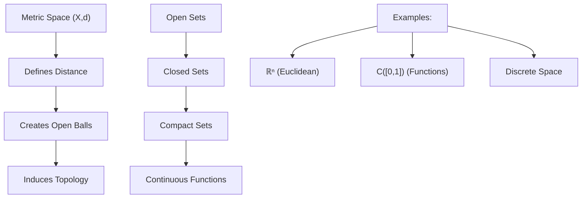

---
aliases:
  - Метрическое пространство
anki: true
created: 2024-12-22 13:25
parent:
  - "[[515.1 Topology]]"
connected:
  - "[[Open Ball]]"
  - "[[Closed Ball]]"
  - "[[Open set]]"
  - "[[Closed set]]"
  - "[[Bounded set]]"
  - "[[Compact set]]"
  - "[[Continuous function]]"
  - "[[Distance function]]"
  - "[[The triangle inequality]]"
tags:
  - content/definition
---

> [!tip] Metric Space
> A **metric space** is a pair $(X,d)$ where $X$ is a set and $d: X \times X \to \mathbb{R}$ is a **metric** (distance function) satisfying:

## Metric Axioms

For all $x,y,z \in X$:

1. **Non-negativity**: $d(x,y) \geq 0$
2. **Identity**: $d(x,y) = 0 \Leftrightarrow x = y$  
3. **Symmetry**: $d(x,y) = d(y,x)$
4. **[[The triangle inequality]]**: $d(x,z) \leq d(x,y) + d(y,z)$

## Standard Examples

### Euclidean Spaces
- $\mathbb{R}^n$ with $d(x,y) = \sqrt{\sum_{i=1}^n (x_i - y_i)^2}$
- $\mathbb{R}$ with $d(x,y) = |x - y|$

### Other Metrics on $\mathbb{R}^n$
- **Manhattan metric**: $d_1(x,y) = \sum_{i=1}^n |x_i - y_i|$
- **Maximum metric**: $d_\infty(x,y) = \max_i |x_i - y_i|$
- **$p$-norm**: $d_p(x,y) = \left(\sum_{i=1}^n |x_i - y_i|^p\right)^{1/p}$

### Function Spaces
- $C([0,1])$ with $d(f,g) = \sup_{x \in [0,1]} |f(x) - g(x)|$
- $L^2([0,1])$ with $d(f,g) = \sqrt{\int_0^1 |f(x) - g(x)|^2 dx}$

### Discrete Spaces
- Any set $X$ with discrete metric: $d(x,y) = \begin{cases} 0 & \text{if } x = y \\ 1 & \text{if } x \neq y \end{cases}$

## Key Concepts

### Open and Closed Sets
- **[[Open Ball|Open ball]]**: $B(x,r) = \{y \in X : d(x,y) < r\}$
- **[[Closed Ball|Closed ball]]**: $\overline{B}(x,r) = \{y \in X : d(x,y) \leq r\}$
- **[[Open set]]**: Union of [[Open Ball|open balls]]
- **[[Closed set]]**: Complement of [[Open set|open set]]

### Convergence
Sequence $(x_n)$ converges to $x$ if: $\lim_{n \to \infty} d(x_n, x) = 0$

## Topology Induced by Metric

Every [[Metric space|metric space]] $(X,d)$ induces a topology where:
- [[Open set|Open sets]] are unions of [[Open Ball|open balls]]
- This makes every [[Metric space|metric space]] a topological space

## Visual Intuition

## Properties

- **Completeness**: Every Cauchy sequence converges
- **Separability**: Contains countable dense subset  
- **Compactness**: Every open cover has finite subcover

# Anki

TARGET DECK: stem::math::topology
START
math_complex
FRONT: Metric Space
BACK: A pair (X,d) where d is a distance function satisfying four axioms
FORMULA: $d: X \times X \to \mathbb{R}$ with non-negativity, identity, symmetry, triangle inequality
ADDITIONAL: Every metric induces a topology via open balls. Foundation for analysis and topology.
ID: 1755890967069
END

TARGET DECK: stem::math::topology
START
math_basic_single
FRONT: Metric space axioms
What are the four axioms that define a metric?
BACK: Non-negativity, identity, symmetry, and triangle inequality
ID: 1755890967073
END

TARGET DECK: stem::math::topology
START
math_basic_single
FRONT: Metric vs topology
How does a metric relate to topology?
BACK: Every metric induces a topology where open sets are unions of [[Open Ball|open balls]] $B(x,r) = \{y: d(x,y) < r\}$
ID: 1755890967077
END
