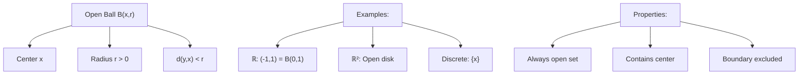

---
aliases:
  - Открытый шар
  - Open neighborhood
  - ε-neighborhood
anki: true
created: 2024-12-22 15:00
parent:
  - "[[515.1 Topology]]"
connected:
  - "[[Metric space]]"
  - "[[Open set]]"
  - "[[Closed Ball]]"
  - "[[Distance function]]"
tags:
  - content/definition
---

> [!tip] Open Ball $B(x,r)$
> The **open ball** centered at point $x$ with radius $r > 0$ in a [[Metric space|metric space]] $(X,d)$ is the set of all points whose distance from $x$ is strictly less than $r$.
> $$B(x,r) = \{y \in X : d(x,y) < r\}$$

## Key Properties

- **Center**: $x \in X$ (always belongs to the ball)
- **Radius**: $r > 0$ (strictly positive)
- **Open**: Every open ball is an [[Open set|open set]]
- **Boundary excluded**: Points at distance exactly $r$ are NOT included

## Examples

### In $\mathbb{R}$ (Real Line)
- $B(0,1) = (-1,1)$ - open interval
- $B(2,3) = (-1,5)$ - interval around 2
- $B(a,\epsilon) = (a-\epsilon, a+\epsilon)$ - ε-neighborhood

### In $\mathbb{R}^2$ (Plane)
- $B((0,0),1) = \{(x,y) : x^2 + y^2 < 1\}$ - open unit disk
- $B((a,b),r) = \{(x,y) : (x-a)^2 + (y-b)^2 < r^2\}$ - open disk

### In Discrete Metric
For discrete metric $d(x,y) = \begin{cases} 0 & \text{if } x = y \\ 1 & \text{if } x \neq y \end{cases}$:
- $B(x,1) = \{x\}$ - singleton
- $B(x,r) = \{x\}$ for any $0 < r \leq 1$
- $B(x,r) = X$ for $r > 1$

## Visual Representation

## Relationship to [[Open set|Open Sets]]

**Fundamental theorem**: A set $U$ is [[Open set|open]] if and only if it can be written as a union of open balls.

$$U \text{ is open} \Leftrightarrow U = \bigcup_{\alpha} B(x_\alpha, r_\alpha)$$

## Applications

1. **Defining [[Open set|open sets]]**: Open balls are the "building blocks"
2. **[[Continuous function|Continuity]]**: $f$ continuous at $x$ ⟺ for every $\epsilon > 0$, $\exists \delta > 0$ such that $f(B(x,\delta)) \subset B(f(x),\epsilon)$
3. **Convergence**: $x_n \to x$ ⟺ for every $r > 0$, eventually $x_n \in B(x,r)$

# Anki

TARGET DECK: stem::math::topology
START
math_basic_double
FRONT: Open Ball $B(x,r)$
BACK: Set of all points at distance strictly less than $r$ from center $x$
ID: 1755934051124
END

TARGET DECK: stem::math::topology
START
math_basic_single
FRONT: Open ball vs closed ball
What's the difference between $B(x,r)$ and $\overline{B}(x,r)$?
BACK: Open ball uses $d(x,y) < r$ (strict inequality), closed ball uses $d(x,y) \leq r$ (includes boundary)
ID: 1755934051127
END

TARGET DECK: stem::math::topology
START
math_complex
FRONT: Open Balls and Open Sets
BACK: Every open set is a union of open balls, and every open ball is an open set
FORMULA: $U$ is open $\Leftrightarrow$ $U = \bigcup_{\alpha} B(x_\alpha, r_\alpha)$
ADDITIONAL: This provides the connection between metric and topological structure
ID: 1755934051130
END
