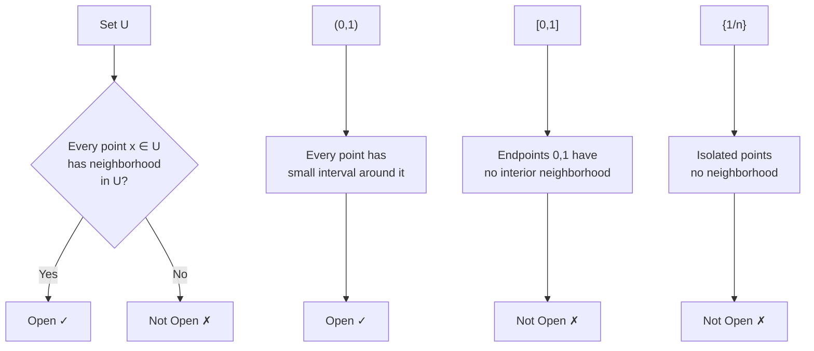

---
aliases:
  - Открытое множество
  - Open subset
anki: true
created: 2024-12-22 14:30
parent:
  - "[[515.1 Topology]]"
connected:
  - "[[Metric space]]"
  - "[[Open Ball]]"
  - "[[Closed set]]"
  - "[[Compact set]]"
  - "[[Continuous function]]"
  - "[[Open cover]]"
tags:
  - content/definition
---

> [!tip] Open Set
> A subset $U$ of a [[Metric space|metric space]] $(X,d)$ is **open** if for every point $x \in U$, there exists $r > 0$ such that the [[Open Ball|open ball]] $B(x,r) \subset U$.

## Equivalent Characterizations

1. **Ball definition**: Every point has a neighborhood contained in the set
2. **Complement**: $U$ is open ⟺ $X \setminus U$ is [[Closed set|closed]]
3. **Interior**: $U$ equals its own interior: $U = \text{int}(U)$

## Key Properties

- **Union**: Arbitrary union of open sets is open
- **Intersection**: Finite intersection of open sets is open
- **Complement**: Complement of open set is closed
- **Empty and universal**: $\emptyset$ and $X$ are both open

## Examples

### Open Sets in $\mathbb{R}$
- $(a,b)$ - open intervals
- $(-\infty, a)$ - infinite intervals
- $\mathbb{R}$ and $\emptyset$ - trivially open
- Union of disjoint intervals: $(0,1) \cup (2,3)$

### Non-Open Sets in $\mathbb{R}$
- $[a,b]$ - [[Closed set|closed intervals]] (boundary points have no interior neighborhood)
- $[a,b)$ - half-open intervals
- $\{a\}$ - singleton sets
- $\mathbb{N}$ - discrete sets in usual topology

## [[Open Ball|Open Balls]]

In any [[Metric space|metric space]], the fundamental open sets are:
$$B(x,r) = \{y \in X : d(x,y) < r\}$$

Every open set is a union of [[Open Ball|open balls]].

## Visual Intuition

## Connection to Other Concepts

### [[Continuous function|Continuity]]
$f: X \to Y$ is continuous ⟺ $f^{-1}(U)$ is open whenever $U$ is open

### [[Compact set|Compactness]] 
Open cover: collection of open sets whose union contains the [[Compact set|compact set]]

### Topology
Open sets define the topological structure - they are the "basic building blocks"

# Anki

TARGET DECK: stem::math::topology
START
math_basic_double
FRONT: Open set
BACK: A set where every point has a neighborhood entirely contained in the set
ID: 1755890967044
END

TARGET DECK: stem::math::topology
START
math_basic_single
FRONT: Open vs closed sets
What is the relationship between open and closed sets?
BACK: A set is open if and only if its complement is closed
ID: 1755890967050
END

TARGET DECK: stem::math::topology
START
math_basic_single
FRONT: Open sets and unions
What happens when you take unions and intersections of open sets?
BACK: Arbitrary union is open, but only finite intersection is open
ID: 1755890967053
END
