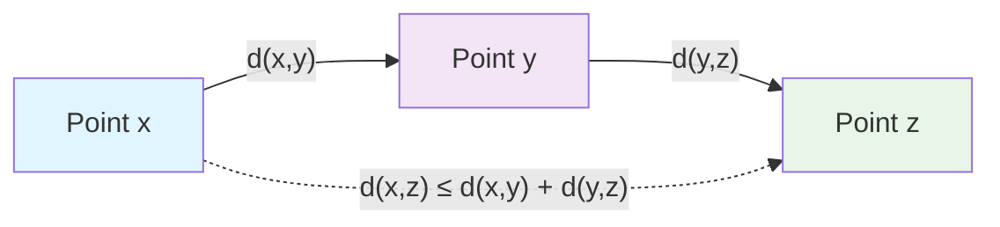

---
aliases:
  - Неравенство треугольника
  - Triangle inequality
anki: true
created: 2024-07-03 22:17
parent:
  - "[[515.1 Topology]]"
  - "[[514 Geometry MOC]]"
connected:
  - "[[Metric space]]"
  - "[[Distance function]]"
  - "[[Norm of vector]]"
tags:
  - content/theorem
---

> [!tip] Triangle Inequality
> For any three points $x, y, z$ in a [[Metric space|metric space]] $(X,d)$: $$d(x,z) \leq d(x,y) + d(y,z)$$

## Intuition

The direct path between two points is never longer than any indirect path through a third point. This fundamental property ensures that distances behave as we expect geometrically.

## In Different Contexts

### [[Metric space|Metric Spaces]]
Core axiom: $d(x,z) \leq d(x,y) + d(y,z)$ for all $x,y,z \in X$

### Real Numbers  
$|a - c| \leq |a - b| + |b - c|$ for all $a,b,c \in \mathbb{R}$

### Euclidean Space
$\|x - z\| \leq \|x - y\| + \|y - z\|$ for vectors in $\mathbb{R}^n$

### Function Spaces
$\|f - h\|_\infty \leq \|f - g\|_\infty + \|g - h\|_\infty$ for [[Continuous function|continuous functions]]

## Geometric Interpretation

## Applications

1. **Convergence**: If $d(x_n, x) \to 0$ and $d(x_n, y) \to 0$, then $d(x,y) = 0$, so $x = y$
2. **Continuity**: Triangle inequality helps prove continuity of [[Distance function|distance function]]
3. **[[519.853.3 Convex optimization MOC|Optimization]]**: Used in proving convergence of optimization algorithms

## Reverse Triangle Inequality

For any [[Metric space|metric space]]: $|d(x,z) - d(y,z)| \leq d(x,y)$

This follows from applying triangle inequality twice.

# Anki

TARGET DECK: stem::math::topology
START
math_basic_double
FRONT: Triangle inequality
BACK: $d(x,z) \leq d(x,y) + d(y,z)$ - direct path never longer than indirect path
ID: 1755890967058
END

TARGET DECK: stem::math::topology  
START
math_basic_single
FRONT: Reverse triangle inequality
State the reverse triangle inequality.
BACK: $|d(x,z) - d(y,z)| \leq d(x,y)$ for any three points in a metric space
ID: 1755890967061
END

TARGET DECK: stem::math::topology
START
math_basic_single
FRONT: Triangle inequality intuition
Why is the triangle inequality fundamental in metric spaces?
BACK: Ensures distances behave geometrically - direct path is shortest, enables convergence and continuity proofs
ID: 1755890967065
END